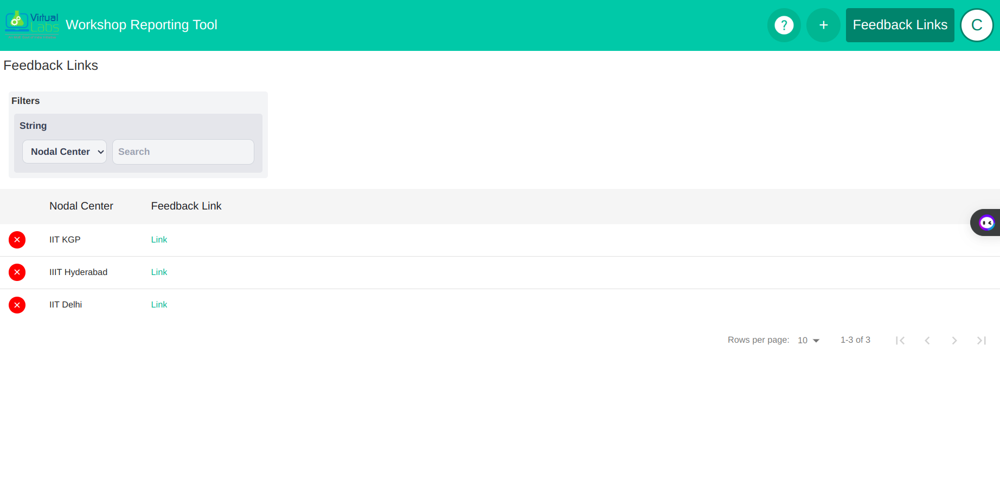

# Workshop Reporting Tool User Guide

## Quick Access

1. [Introduction](#introduction)
2. [Definitions](#definitions)
3. [User Privileges](#user-privileges)
4. [Walkthrough of the Workshop Reporting Tool](#walkthrough-of-the-outreach-tool)
   - [Logging In](#logging-in)
   - [Dashboard](#dashboard)
   - [Managing Workshops](#managing-workshops)
   - [Managing Templates](#managing-templates)
   - [Managing Users and Institutes](#managing-users-and-institutes)
   - [Managing Feedback Links](#managing-feedback-links)
   - [Logging Out](#logging-out)
5. [Support and Updates](#support-and-updates)

## Introduction

The [Workshop Reporting Tool ](https://outreach.vlabs.ac.in/) is designed to facilitate the storage and management of workshop data for Virtual Labs. It allows nodal coordinators from various institutes to access and maintain workshop information efficiently.

## Definitions
   - Workshop: The workshop will be a hands-on session introducing Virtual Labs to students and faculty. It will include demos of experiments to help everyone understand the navigation process.
   - Usage: It refers to each time you load both the content and simulation of a single experiment.

## User Privileges

| Operation        | Nodal Coordinator |
| ---------------- | ----------------- |
| Add Workshop     | \*Yes             |
| Delete Workshop  | \*Yes             |
| Edit Workshop    | \*Yes             |
| Add Template     | Yes               |
| Delete Template  | No                |
| Add User         | No                |
| Delete User      | No                |
| Add Institute    | No                |
| Delete Institute | No                |
| View Workshop    | \*Yes             |

\* Nodal coordinators can only view, add, delete, and edit workshops that are added to them.

## On-Boarding Process

Upon being appointed as the Nodal Coordinator, access to the portal is granted to you using the email provided in the Expression of Interest Document.

## Walkthrough of the Workshop Reporting Tool

### Logging In

Upon navigating to the [Workshop Reporting Tool](https://outreach.vlabs.ac.in/) (@ https://outreach.vlabs.ac.in), Nodal coordinators will be presented with the login page. You can log in using their Google credentials.

### Dashboard

After successful login, you will be logged into the Nodal Coordinator dashboard. The dashboard provides an overview of workshops and other relevant information.

### Managing Workshops

Nodal Coordinator can manage their workshops by adding, editing, or deleting workshop records. They can also view detailed information about each workshop.

### Viewing Templates

Nodal Coordinators can view different templates for workshop records to streamline data entry and ensure consistency. 

### Viewing Nodal Centers

Nodal Coordinators can view other registered nodal centers.

### Viewing Feedback Links

The Nodal Coordinator can access the feedback form links to collect the data from workshops. This feature allows for easy access to feedback forms and data collection.

### Logging Out

The Nodal Coordinator can log out of the Workshop Reporting tool by clicking on the logout button located in the navigation menu. This ensures the security of their account and data.

## Support and Updates

Regular updates and versioning are provided to ensure the tool's functionality and security. For any assistance or inquiries, please contact us at ioc-iiith@vlabs.ac.in.
