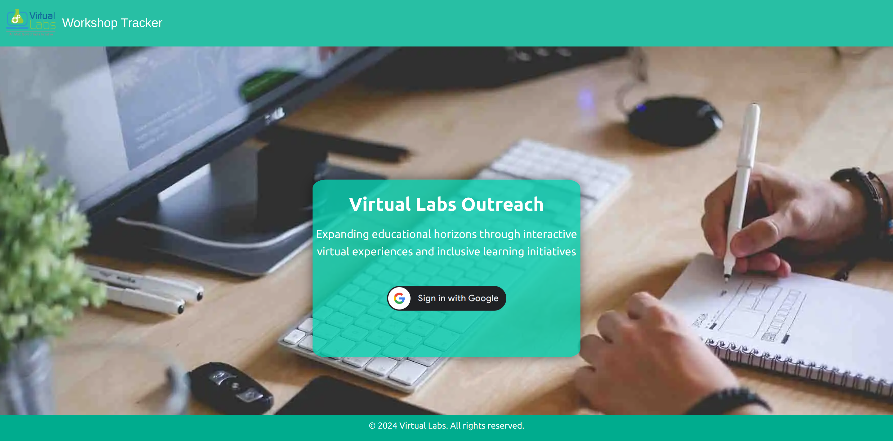
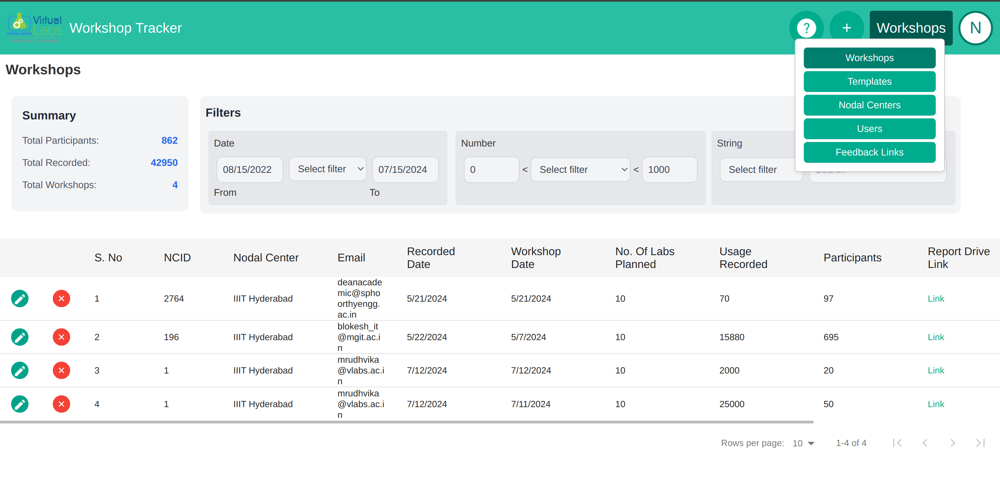
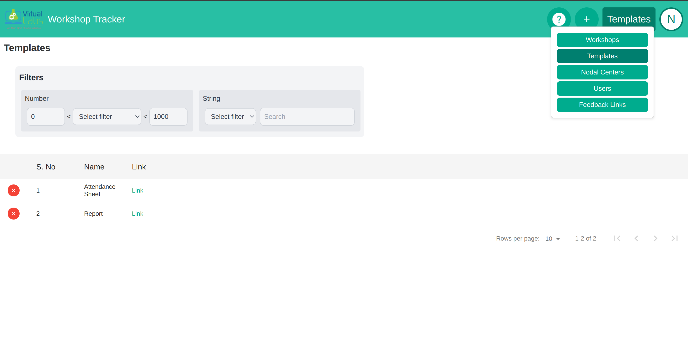
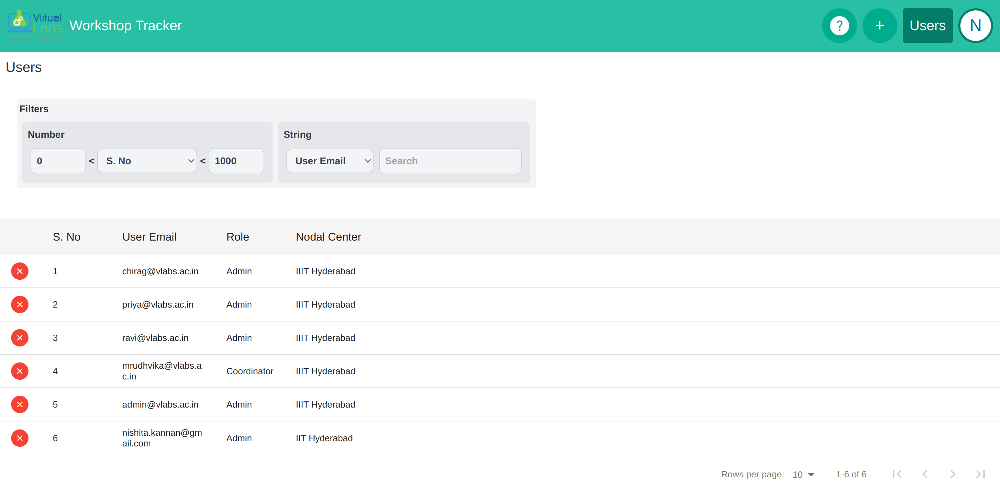

# Workshop Tracker Documentation

## Table of Contents

1. [Introduction](#introduction)
2. [Features](#features)
3. [User Privileges](#user-privileges)
4. [Walkthrough of the Workshop Tracker](#walkthrough-of-the-workshop-tracker)
   - [Logging In](#logging-in)
   - [Dashboard](#dashboard)
   - [Managing Workshops](#managing-workshops)
   - [Managing Templates](#managing-templates)
   - [Managing Users and Institutes](#managing-users-and-institutes)
   - [Logging Out](#logging-out)
5. [Support and Updates](#support-and-updates)

## Introduction

The [Workshop Tracker](https://outreach.vlabs.ac.in/) is designed to facilitate the storage and management of workshop data for Virtual Labs. It allows admins and nodal coordinators from various institutes to access and maintain workshop information efficiently.

## Features

- Store and manage workshop data.
- Utilize different templates for workshop records.
- Google authorization for both admin and coordinator users.

## User Privileges

| Operation        | Admin User | Nodal Coordinator |
| ---------------- | ---------- | ----------------- |
| Add Workshop     | Yes        | \*Yes             |
| Delete Workshop  | Yes        | \*Yes             |
| Edit Workshop    | Yes        | \*Yes             |
| Add Template     | Yes        | Yes               |
| Delete Template  | Yes        | No                |
| Add User         | Yes        | No                |
| Delete User      | Yes        | No                |
| Add Institute    | Yes        | No                |
| Delete Institute | Yes        | No                |
| View Workshop    | Yes        | \*Yes             |

\* Nodal coordinators can only view, add, delete, and edit workshops that are added by them.

## Walkthrough of the Workshop Tracker
### Logging In

Upon navigating to the [Workshop Tracker](https://outreach.vlabs.ac.in/), users will be presented with the login page. Users can log in using their Google credentials.

Mobile view:

### Dashboard

After successful login, users will land on the dashboard. The dashboard provides an overview of workshops and other relevant information.

Mobile view:

Summary of a page can be viewed by clicking on the summary button present in the top of the workshop page.

Filters can be added to aid in searching by clicking on the filter button present on the top of the page.

### Managing Workshops

Admin and Nodal Coordinator users can manage workshops by adding, editing, or deleting workshop records. They can also view detailed information about each workshop.

Mobile view:

### Managing Templates

Users can utilize different templates for workshop records to streamline data entry and ensure consistency. They can add, edit, or delete templates as needed.

Mobile view:

### Managing Users and Institutes

Admin users have the privilege to add, edit, or delete user accounts and institute information. This allows for efficient management of user access and organization data.

Mobile view:

### Logging Out

Users can log out of the [Workshop Tracker](https://outreach.vlabs.ac.in/) by clicking on the logout button located in the navigation menu. This ensures the security of their account and data.

Mobile view:

## Support and Updates

Regular updates and versioning are provided to ensure the tool's functionality and security.
